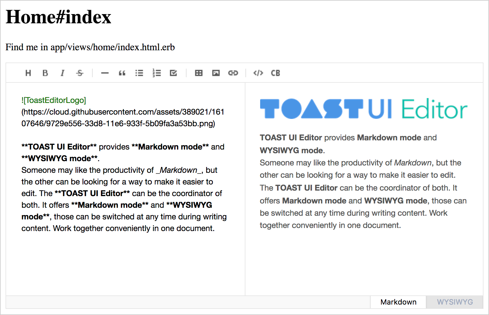

# 레일스 프로젝트에 TOAST UI Editor 설치하기

[매뉴얼](https://github.com/nhnent/tui.editor/wiki/Getting-Started-Korean)에 따르면 **tui-editor** 패키지는 **bower**로 설치할 것을 권하고 있다. 

레일스 프로젝트에서는 **bower-rails** 젬을 번들 인스톨하면 자동으로 **bower**를 사용할 수 있는 환경을 셋팅해 준다.

## 1. 젬 추가

먼저 **Gemfile**에 다음과 같이 추가하고, 

```ruby
gem "bower-rails", "~> 0.11.0"
```

번들 인스톨한다.

```shell
$ bundle install
```

## 2. Bower 초기화

다음은 레일스 프로젝트에서 **bower**를 사용할 수 있도록 환경을 세팅해 줄 필요가 있으며 다음과 같은 명령을 실행 한다.

```shell
$ rails g bower_rails:initialize
Running via Spring preloader in process 79022
      create  Bowerfile
      create  config/initializers/bower_rails.rb
```

## 3. 패키지 설치

위의 명령이 실행될 때 자동으로 생성된 **Bowerfile** 파일을 열고 다음과 같이 패키지명을 추가한다.

```ruby
asset 'tui-editor'
```

이제 추가한 패키지를 설치한다. 

```shell
$ rake bower:install
bower.js files generated
/usr/local/bin/bower install -p
bower tui-editor#*              cached https://github.com/nhnent/tui.editor.git#1.0.2
bower tui-editor#*            validate 1.0.2 against https://github.com/nhnent/tui.editor.git#*
bower tui-editor#*                 new version for https://github.com/nhnent/tui.editor.git#*
bower tui-editor#*             resolve https://github.com/nhnent/tui.editor.git#*
bower tui-editor#*            download https://github.com/nhnent/tui.editor/archive/v1.0.3.tar.gz
bower tui-editor#*             extract archive.tar.gz
bower tui-editor#*            resolved https://github.com/nhnent/tui.editor.git#1.0.3
bower tui-code-snippet#^1.2.9   cached https://github.com/nhnent/tui.code-snippet.git#1.2.9
bower tui-code-snippet#^1.2.9 validate 1.2.9 against https://github.com/nhnent/tui.code-snippet.git#^1.2.9
bower highlightjs#^9.12.0       cached https://github.com/components/highlightjs.git#9.12.0
bower highlightjs#^9.12.0     validate 9.12.0 against https://github.com/components/highlightjs.git#^9.12.0
bower markdown-it#^8.4.0        cached https://github.com/markdown-it/markdown-it.git#8.4.0
bower markdown-it#^8.4.0      validate 8.4.0 against https://github.com/markdown-it/markdown-it.git#^8.4.0
bower codemirror#^5.32.0        cached https://github.com/components/codemirror.git#5.34.0
bower codemirror#^5.32.0      validate 5.34.0 against https://github.com/components/codemirror.git#^5.32.0
bower squire-rte#^1.8.11        cached https://github.com/neilj/Squire.git#1.8.11
bower squire-rte#^1.8.11      validate 1.8.11 against https://github.com/neilj/Squire.git#^1.8.11
bower tui-color-picker#^2.0.1   cached https://github.com/nhnent/tui.color-picker.git#2.0.1
bower tui-color-picker#^2.0.1 validate 2.0.1 against https://github.com/nhnent/tui.color-picker.git#^2.0.1
bower to-mark#^1.0.0            cached https://github.com/nhnent/to-mark.git#1.0.0
bower to-mark#^1.0.0          validate 1.0.0 against https://github.com/nhnent/to-mark.git#^1.0.0
bower jquery#^3.3.1             cached https://github.com/jquery/jquery-dist.git#3.3.1
bower jquery#^3.3.1           validate 3.3.1 against https://github.com/jquery/jquery-dist.git#^3.3.1
bower plantuml-encoder#^1.2.5   cached https://github.com/markushedvall/plantuml-encoder.git#1.2.5
bower plantuml-encoder#^1.2.5 validate 1.2.5 against https://github.com/markushedvall/plantuml-encoder.git#^1.2.5
bower tui-chart#^2.13.0         cached https://github.com/nhnent/tui.chart.git#2.15.0
bower tui-chart#^2.13.0       validate 2.15.0 against https://github.com/nhnent/tui.chart.git#^2.13.0
bower raphael#2.2.0b        not-cached https://github.com/nhnent/raphael.git#2.2.0b
bower raphael#2.2.0b           resolve https://github.com/nhnent/raphael.git#2.2.0b
bower raphael#2.2.0b          download https://github.com/nhnent/raphael/archive/2.2.0b.tar.gz
bower raphael#2.2.0b           extract archive.tar.gz
bower raphael#2.2.0b      invalid-meta for:/var/folders/g0/thd8gm_14g9_wnht5815r98c0000gn/T/lucius/bower/aa622d1829f3f68127c00e2df48320b5-79135-1goacG/bower.json
bower raphael#2.2.0b      invalid-meta The "main" field cannot contain minified files
bower raphael#2.2.0b          resolved https://github.com/nhnent/raphael.git#38d4ba69d2
bower eve#eef80ed               cached https://github.com/adobe-webplatform/eve.git#eef80ed
bower eve#eef80ed             validate eef80ed against https://github.com/adobe-webplatform/eve.git#eef80ed
bower eve#eef80ed            short-sha Consider using longer commit SHA to avoid conflicts
bower tui-editor#*             install tui-editor#1.0.3
bower tui-code-snippet#^1.2.9  install tui-code-snippet#1.2.9
bower highlightjs#^9.12.0      install highlightjs#9.12.0
bower codemirror#^5.32.0       install codemirror#5.34.0
bower markdown-it#^8.4.0       install markdown-it#8.4.0
bower squire-rte#^1.8.11       install squire-rte#1.8.11
bower tui-color-picker#^2.0.1  install tui-color-picker#2.0.1
bower to-mark#^1.0.0           install to-mark#1.0.0
bower plantuml-encoder#^1.2.5  install plantuml-encoder#1.2.5
bower tui-chart#^2.13.0        install tui-chart#2.15.0
bower jquery#^3.3.1            install jquery#3.3.1
bower raphael#2.2.0b           install raphael#38d4ba69d2
bower eve#eef80ed              install eve#eef80ed

tui-editor#1.0.3 bower_components/tui-editor
├── codemirror#5.34.0
├── highlightjs#9.12.0
├── jquery#3.3.1
├── markdown-it#8.4.0
├── plantuml-encoder#1.2.5
├── squire-rte#1.8.11
├── to-mark#1.0.0
├── tui-chart#2.15.0
├── tui-code-snippet#1.2.9
└── tui-color-picker#2.0.1

tui-code-snippet#1.2.9 bower_components/tui-code-snippet

highlightjs#9.12.0 bower_components/highlightjs

codemirror#5.34.0 bower_components/codemirror

markdown-it#8.4.0 bower_components/markdown-it

squire-rte#1.8.11 bower_components/squire-rte

tui-color-picker#2.0.1 bower_components/tui-color-picker
└── tui-code-snippet#1.2.9

to-mark#1.0.0 bower_components/to-mark

plantuml-encoder#1.2.5 bower_components/plantuml-encoder

tui-chart#2.15.0 bower_components/tui-chart
├── raphael#38d4ba69d2
└── tui-code-snippet#1.2.9

jquery#3.3.1 bower_components/jquery

raphael#38d4ba69d2 bower_components/raphael
└── eve#eef80ed

eve#eef80ed bower_components/eve
```

위의 명령이 실행되면 패키지가 **vendor/assets/bower_components** 디렉토리에 설치될 것이다. 

[레일스 가이드](http://guides.rubyonrails.org/asset_pipeline.html#asset-organization)에 의하면 레일스는 디폴트로 **app/assets**, **lib/assets**, **vendor/assets** 디렉토리를 **asset pipeline**과 자동으로 연결해 준다. 따라서 더 이상의 추가적인 설정없이 방금 전에 설치한 **TOAST UI Editor** 패키지의 자원을 사용할 수 있게 된다. 

## 4. 자바스크립트 추가하기

**app/assets/javascripts/application.js**  파일을 열고 다음과 같이 작성한다.

```javascript
//= require jquery/dist/jquery
//= require tui-code-snippet/dist/tui-code-snippet
//= require markdown-it/dist/markdown-it
//= require to-mark/dist/to-mark
//= require codemirror/lib/codemirror
//= require highlightjs/highlight.pack
//= require squire-rte/build/squire
//= require tui-editor/dist/tui-editor-Editor.min
//= require activestorage
//= require turbolinks
//= require_tree .
```

## 5. 스타일시트 추가하기

app/assets/stylesheets/application.scss 파일을 열고 다음과 같이 추가한다.

```scss
@import 'codemirror/lib/codemirror';
@import 'highlightjs/styles/github';
@import 'tui-editor/dist/tui-editor';
@import 'tui-editor/dist/tui-editor-contents';
```

## 6. 에디터 생성하기

마지막으로 원한는 뷰 파일을 열과 다음과 같이 작성한다.

```html
<div id="editSection"></div>
<script>
    $('#editSection').tuiEditor({
        initialEditType: 'markdown',
        previewStyle: 'vertical',
        height: 400
    });
</script>
```

